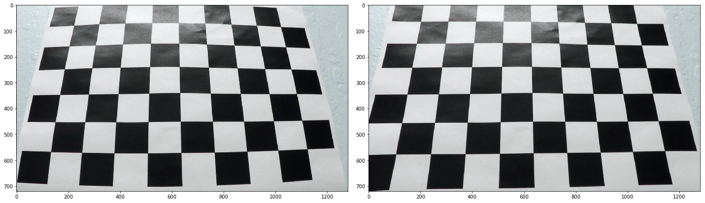
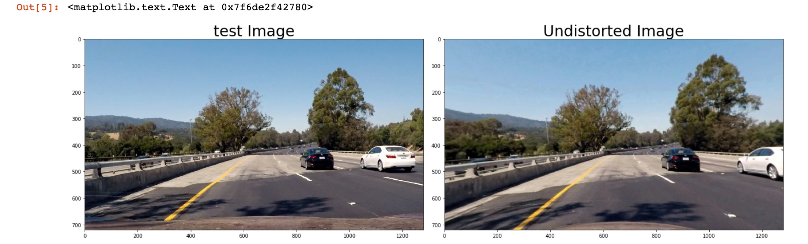
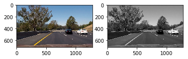
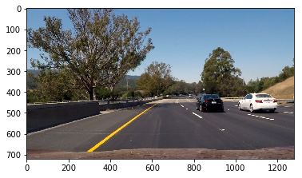
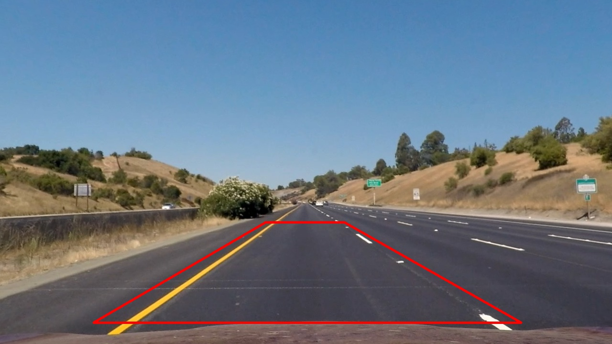
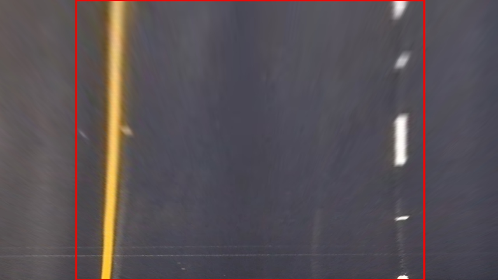
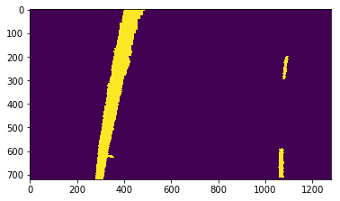
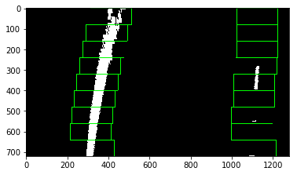
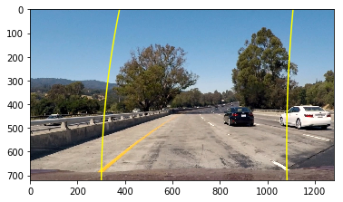
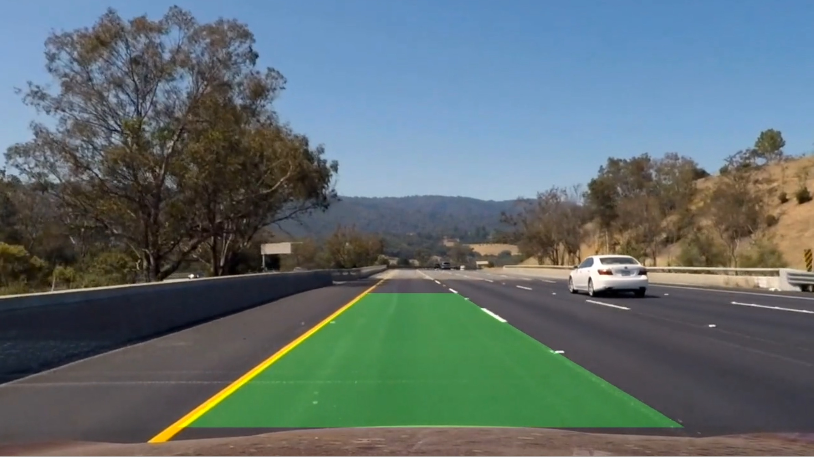

# LaneCurveDetection

## This project aims at detecting lanes on a road and its curvature

Results: https://github.com/sebastienpig/LaneCurveDetection/blob/master/video_road/processed_video/project_video.mp4

Visual includes coloring the surface between the left and the right lanes

Pipeline includes:

<h3> Calibrating the camera </h3>
The calibration of the camera is done through a chessboard view under different angles.
Parameters are saved and used later on.

The parameters are saved in a python object:  

<pre>

class calibration:
         
    def __init__(self):
        self.dist=0  # distortion coefficients
        self.mtx=0   #  camera matrix to transform 3D pts to 2D points
        self.rvecs=0 # rotation vector
        self.tvecs=0 # translation vector
    
    def calibrate(self,mtx, dist, rvecs, tvecs):
        self.mtx=mtx   #  camera matrix to transform 3D pts to 2D points
        self.dist=dist  # distortion coefficients
        self.rvecs=rvecs # rotation vector
        self.tvecs=tvecs # translation vector

    def show_parameters(self):
        print ("dist:", self.dist)
        print ("mtx:", self.mtx)
        print ("rvecs:", self.rvecs)
        print ("tvecs:", self.tvecs)
</pre>

First the image is turned into greyed scale, then corner are found using a openCV function to finally gives the points to the <b>cv2.calibrateCamera</b> function. 

<pre>
# Convert to grayscale
        gray = cv2.cvtColor(img, cv2.COLOR_RGB2GRAY)
        gray_size = (gray.shape[1], gray.shape[0])
        
        # Find checkboard corners
        ret, corners = cv2.findChessboardCorners(gray, (nx, ny), None)
       
        if ret == True: #matching points were found
        
            # Add points to list
            objpoints.append(objptm)
            imgpoints.append(corners)

            cv2.drawChessboardCorners(img, (nx, ny), corners, ret)
</pre>

<h3> Undistorting the image </h3>
The openCV function used is cv2.undistort(image, calib.mtx, calib.dist, None, calib.mtx)

We can see clearly in the below example that the image has been undistorded and looks flat.

Here is an example on the road is:  

We can see that the trees and the mountain have changed, mountain is higher and trees look bigger.

<h3> Applying filter on the image </h3>

After trying different filters like grey, and threshold, I used the HLS filter that is enhancing the lanes:
 
HLS Filter  
 
<pre>
def hls_select(img, thresh=(0, 255)):
    hls = cv2.cvtColor(img, cv2.COLOR_RGB2HLS)
    s_channel = hls[:,:,2]
    binary_output = np.zeros_like(s_channel)
    binary_output[(s_channel > thresh[0]) & (s_channel <= thresh[1])] = 1
    return binary_output
</pre>
S Space  
 

<h3> Choosing a region of interest to warp/unwarp </h3>

The region of interest tries to eliminate the elements that could disturb the lane detection.
It is lower than the horizon and restricted to the center of the left lane, encompassing both lanes on its borders.

<h3>  Warping the region of interest </h3>

The operation is done in three steps:
1) apply filter
2) undistord the image
3) warping

<pre>
<li><b># Read the image</b></li>
test_img = 'road_images/test3.jpg'
img_original = mpimg.imread(test_img) 

<li><b># Step 1: Undistord the image</b></li>
image_undistorted = undistort_road_image(img_original, calib)
#img_mask = pipeline(img)

<li><b># Step 2: Apply a mask to see the lanes more clearly</b></li>
filtered_img = hls_select(image_undistorted, thresh=(50, 255))#(90, 255)

<li><b># Step 3: Get a bird view of the lanes using a zone</b></li>
img_warped, M, Minv = get_birds_eye_view(filtered_img)
</pre>

<table>
  <tr>
    <th>original</th>
    <th>warped</th>
  </tr>
  <tr>
    <td></td>
    <td></td>
  </tr>
  </table>

<h3> Detecting left and right lanes from an histogram </h3>

<table>
  <tr>
    <th>detected pixels</th>
    <th>histogram</th>
  </tr>
  <tr>
    <td></td>
    <td>$</td>
  </tr>
  </table>

<h3> Fitting a polynom from the detected lanes </h3> 

We define two research areas corresponding to the peak of the histogram, those are the leftx_base and rightx_base.
Then across 9 windows we will identify the nonzero pixels, count them and tke their mean. The next window is adjusted on the mean if there are more than 50 pixels found.

Once all the 9 windows have been looked at and the indexes of all pixels accumulated a polynome is extracted:  

<pre>
 left_fit = np.polyfit(lefty, leftx, 2)
</pre>

<pre>
# Current positions to be updated for each window
    leftx_current = leftx_base
    rightx_current = rightx_base
    
    # Set the width of the windows +/- margin
    margin = 100 
    
    # Set minimum number of pixels found to recenter window
    minpix = 50
  
  ...

    
    # Step through the windows one by one
    for window in range(nwindows):
        # Identify window boundaries in x and y (and right and left)
        win_y_low = img_warped.shape[0] - (window+1)*window_height
        win_y_high = img_warped.shape[0] - window*window_height
        
        win_xleft_low = leftx_current - margin
        win_xleft_high = leftx_current + margin
        
        win_xright_low = rightx_current - margin
        win_xright_high = rightx_current + margin
        
</pre>

A Successfll extraction will look like: 

<li> Avoiding losing track </li>  

In case pixels cannot be detected in an enough quantity in at least 2 windows, which should be enough to give the curve of the polynome I would use pixels from a previous position that had at least two qualifying windows: 

<pre>
# Extract left and right line pixel positions
    leftx = nonzerox[left_lane_inds]
    lefty = nonzeroy[left_lane_inds] 
    rightx = nonzerox[right_lane_inds]
    righty = nonzeroy[right_lane_inds]
    
    if (cpt_empty_windows <8):
        myLine.historial_rightx = rightx
        myLine.historial_righty = righty
        myLine.historial_leftx = leftx
        myLine.historial_lefty = lefty
</pre>

I also take the median of the last 5 frames to avoid jumps in the coefficients:

<pre>
if (myLine.counter==5):  # taking the median of the last 5 frames to avoid crazy jumps
            myLine.counter -= 1
            
            if (0): # checking the pixels exist in the array
                print ("reset length of myLine.left_lane_pixels", len(myLine.left_lane_pixels))
                
            left_lane_pixels_array = np.asarray(myLine.left_lane_pixels)   
            left_fit = np.median(left_lane_pixels_array, axis=0)
 </pre>

<h3>  Coloring the area between the lanes </h3> 

A <b>polygone</b> is retrieved from the <b>warped area</b> and <b>colored</b>, and then <b>superimposed</b> on the <b>undistorded</b> image. 

<pre>

...
    #Draw the lane onto the warped blank image
    cv2.fillPoly(color_warp, np.int_([pts]), (0,255, 0))

    # Warp the blank back to original image space using inverse perspective matrix (Minv)
    newwarp = cv2.warpPerspective(color_warp, Minv, (image_undistorted.shape[1], image_undistorted.shape[0])) 
    # Combine the result with the original image
    result = cv2.addWeighted(image_undistorted, 1, newwarp, 0.3, 0)
    
</pre>
<h3>  Adding to the original image and unwarp the combined image </h3> 

<h3>  Calculating the curvature </h3> 

 We define a conversions in x and y from pixels space to meters and use a conversion factor. We use the points previoulsy extracted for drawing the curve using a polynome.

<pre>

    ym_per_pix = 30 / 720  # meters per pixel in y dimension
    xm_per_pix = 3.7 / 700  # meters per pixel in x dimension
    
    # Fit new polynomials to x,y in world space
    left_fit_cr = np.polyfit(ploty*ym_per_pix, left_fit*xm_per_pix, 2)
    right_fit_cr = np.polyfit(ploty*ym_per_pix, right_fit*xm_per_pix, 2)
    
    # Calculate the new radii of curvature
    left_curverad = ((1 + (2*left_fit_cr[0]*y_eval*ym_per_pix + left_fit_cr[1])**2)**1.5) / np.absolute(2*left_fit_cr[0])
    right_curverad = ((1 + (2*right_fit_cr[0]*y_eval*ym_per_pix + right_fit_cr[1])**2)**1.5) / np.absolute(2*right_fit_cr[0])
    
 </pre>
 
 <li> Position of the car </li> 
 The position of the vehicle assumes the camera is mounted in the middle of the car (image full screen). 
 We choose for the computation a pixel that belongs to each lane left and right, we add their coordinate and we compare with the midde of the image. A coefficient is applyed to get the value in meter.
 We can decide to send a warning in case the car deviates by more than 2 meters, maybe the driver is sleeping.
 
 <pre>
    screen_middel_pixel = img.shape[1]/2
    err=0 #to return erronous value in case of an error
    
    xm_per_pix = 3.7 / 700
    
    left_lane_pixel = left_fit[::-1][0]    # x position for left lane
    right_lane_pixel = right_fit[::-1][0]   # x position for right lane
    
    car_position = int((right_lane_pixel + left_lane_pixel)/2)
    pixel_from_center = screen_middel_pixel-car_position
    meters_from_center = xm_per_pix * pixel_from_center
    
    if meters_from_center>=0:
        side="left"
    else:
        side="right"
    
    print("Car is {} off center.".format(meters_from_center))
    
    if ((meters_from_center >2) or (meters_from_center<-2)):
        err=1
 </pre>
 
<h3>  Processing the video stream </h3> 

We use a function that is reading frame by frame the video stream and applies the pipeline.
BEfore doing so we create a Line object that will save many of the vector of points used in the lane detection.

myLine=Line()

<b>Read video </b>
clip = VideoFileClip(video_reference)
    
<b>Process video</b>
clip_processed = clip.fl_image(tracking_road) 

<h3> Discussions </h3>

In this project the most difficult part is to be robust to the change of shade on the road. 
I coped with this problem by memorizing the last set of pixels that likely derived a "good" lane with at least two sliding windows with more than 50 pixels. 

In the normal case where more than windows are detected I also take the median of the last frames to smooth the drawing of the lanes and avoid jumps in the coefficients.  

The techniques would have been put under stress if the curves were changing directions abruptly but as mentioned in the class the regulators in the US impose a certain max curvature.
Also if the car were to drive too fast compared to the sampling rate of the camera I could be subject to frames with very different curves. However it is likely not to happen since camera are fast enough nowadays. 

Finally, using more filtering techniques it is possible to enhance the detection of the lane by applying several filters consecutively to get more the yellow lanes, white lane, decrease the impact of shadow for example.
